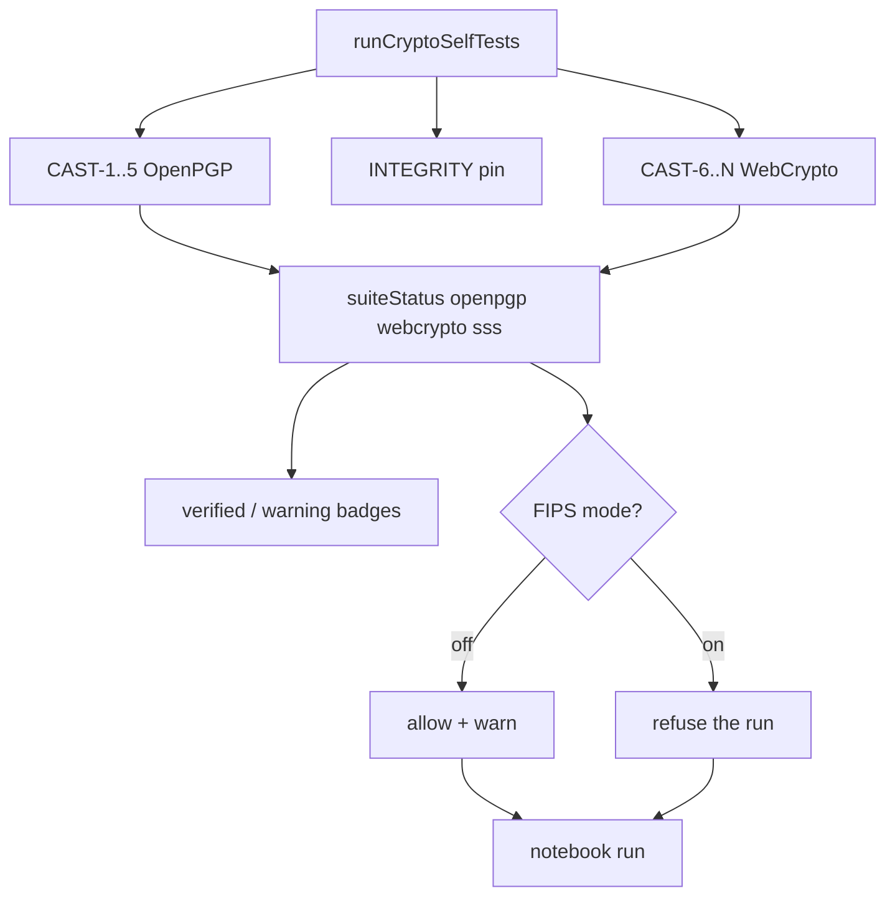

# Plan: CAST coverage + remaining test gaps

> **Status (2026-07-26):** Implemented — suite badges + FIPS mode (Phase 0), CAST-6…11 + CAST-13/14 WebCrypto + CAST-12 SSS/BLIP39, expanded unit/type tests, CRYPTOGRAPHY.md updates. Quorum CAST suite and OpenPGP padding remain deferred.

> **Worker note (later than the plan below).** This plan assumed the toolkit
> could run inside the crypto worker, and half its enforcement story is written
> in those terms: a `toolkit-run` message, a worker that refuses, a second
> double-check behind the UI. That arm existed and was complete, and **nothing
> in the app ever posted to it** — `lib/generate-key.js` holds the only
> `new Worker(…crypto-worker.js…)` and the only message it sends is
> `type:"generate"`. The arm, `lib/toolkit/toolkit-run.js` and its
> `executeToolkitRun` entry point have all been deleted; see the header of
> [`crypto-worker.js`](../web/src/lib/crypto-worker.js) for the argument.
>
> So wherever the plan below says *worker* as a second enforcement point, there
> is one enforcement point and it is the notebook: `useNotebook.buildBindings`
> sets `fipsMode`/`suiteStatus` and `startRun` asks the gate about the whole run
> before the first cell executes. That is a simplification rather than a gap —
> the removed check guarded a message nobody sent — but it does mean the
> "UI bypass is not enough" argument in Phase 0 now rests on the gate sitting
> inside `runRecipe` rather than on a separate process. Routing the notebook
> through a worker is still a defensible design; it needs its own argument
> rather than arriving as this plan's leftover.

> **Vocabulary note (later than the plan below).** Where this document says
> *Quorum* it means the multi-party P2P session, since renamed the **shared
> notebook** (`web/src/lib/notebook/`). `web/src/lib/quorum/` now holds only the
> *m*-of-*n* threshold code. The deferred item is a CAST suite for the shared
> notebook's ECDH/HKDF/AES-GCM, and it is still deferred.

Extend FIPS-inspired POST/CAST to cover shipped WebCrypto toolkit paths (today only OpenPGP CAST-1…5 run), make the **UI refuse to imply verification it does not have**, then fill unit/type test gaps and document remaining deferred product items.

## Problem

[`web/src/lib/crypto-self-test.js`](../web/src/lib/crypto-self-test.js) still runs **OpenPGP-only** CAST-1…5 (+ integrity pin). Encrypt / Decrypt / Toolkit UIs show a single “crypto verified” latch, then the toolkit enables **Run** for recipes that call **SubtleCrypto** ops (`digest`, `sign`, `aes-gcm`, `hkdf`, `pbkdf2`, `ecdh`, `wrap`) that CAST never exercised. SSS/BLIP39 is similarly ungated.

[`web/src/test/toolkit-webcrypto.test.js`](../web/src/test/toolkit-webcrypto.test.js) is a narrow smoke matrix (mostly Ed25519 / AES-256 / P-256). Quorum session crypto is also WebCrypto and remains outside the CAST gate (document explicitly; optional later).

*Diagram corrected: it had both branches feed a `toolkit-run` worker node. See
the worker note at the top — there is no worker leg, and the toggle's two
outcomes are read by the notebook's own run path. The plan's `block add` half
never shipped either: FIPS refuses a run, it does not stop you writing the
recipe.*

---

## Phase 0 — UI honesty + FIPS mode toggle

Stop the false green light **before or while** WebCrypto CASTs land. Default UX stays usable with **warning badges**; a **FIPS mode** toggle hard-enforces verified-only crypto.

### Model: verification suites (not one boolean)

Replace the toolkit’s single “all crypto OK” banner with suite status derived from POST results:

| Suite | Covers toolkit `toolbox` | Today | After Phase A |
|-------|--------------------------|-------|---------------|
| `openpgp` | `openpgp` | CAST-1…5 → verified | same |
| `webcrypto` | `webcrypto` | **unverified** | CAST-6…11 → verified |
| `sss` | `sss` | **unverified** (no CAST yet) | optional CAST later |
| _(none)_ | `encoding`, `io`, `flow` | always usable; **no** VERIFIED claim | same |

Export from [`crypto-self-test.js`](../web/src/lib/crypto-self-test.js):

- `getSuiteStatus()` → `{ openpgp, webcrypto, sss }` each `verified | unverified | error`
- `assertSuiteReady(suite)` for hard gates
- Module ERROR still blocks everything crypto-related (FIPS on or off)

### Warning badges (always on)

Regardless of FIPS mode:

1. **Ops drawer / suggest-next / pipeline cards**
   - Verified crypto toolbox: small green **verified** chip.
   - Unverified crypto toolbox/op: amber **warning** badge (e.g. `⚠ unverified` / `no CAST`).
   - Tooltip: which suite is missing and that FIPS mode will block it.
   - Non-crypto toolboxes (`encoding` / `io` / `flow`): no verified claim, no warning.

2. **Status banner**
   - Suite-aware, never “all crypto verified” when only OpenPGP passed.
   - Example: `OpenPGP ✓ · WebCrypto ⚠ · SSS ⚠ · root …`
   - After Phase A: `OpenPGP ✓ · WebCrypto ✓ · SSS ⚠ · …`

3. **Encrypt / Decrypt**
   - Keep OpenPGP CAST gate. Banner says **OpenPGP** verified (not generic “crypto module”) until both OpenPGP + WebCrypto suites pass if we ever share copy.

### FIPS mode toggle

Explicit control on the toolkit header (encrypt/decrypt/settings later if useful):

| FIPS mode | Unverified suite ops | Run |
|-----------|----------------------|--------------|
| **Off** (default for exploration) | Usable; amber warning badges only | Allowed; optional status note “recipe uses unverified suites” |
| **On** | Cannot add from drawer / suggest; existing steps marked blocked | **Run refused** with a clear error, before the first step executes |

When FIPS **on**:

- Block append/drag of ops whose toolbox maps to an unverified suite.
- If recipe already contains them (paste/load/preset): keep visible, blocked cards, disable Run, error like `FIPS mode: recipe uses unverified WebCrypto ops (aes-gcm, sign)`.
- Engine double-check: refuse unverified suites when FIPS is on (the flag rides in the bindings the notebook hands `runRecipe`) so UI bypass is not enough. *Planned as an engine/worker pair; only the engine half exists — see the worker note.*
- Persist preference (`localStorage` e.g. `basilisk.fipsMode`).
- **Disclaimer:** this is Basilisk’s FIPS-*inspired* posture (POST/CAST + verified-only), **not** a NIST FIPS 140 certificate. Tooltip/subtitle: `Verified suites only (POST/CAST). Not a FIPS 140 certificate.`

If “FIPS mode” is too strong for product/legal copy, rename to `Strict CAST` / `Verified only` — keep the same behavior.

### SSS under FIPS mode

Same as WebCrypto: warning badge always; blocked when FIPS on until an SSS CAST exists. No carve-out unless we later document and remove it from the gate on purpose.

---

## Phase A — WebCrypto CASTs in POST (primary)

Extend `_runAllTests()` in [`web/src/lib/crypto-self-test.js`](../web/src/lib/crypto-self-test.js). Prefer calling helpers from [`web/src/lib/toolkit/webcrypto-ops.js`](../web/src/lib/toolkit/webcrypto-ops.js) so CAST and toolkit share one implementation (avoid drift). Keep OpenPGP CAST-1…5 unchanged.

| ID | Name | Concrete check |
|----|------|----------------|
| **CAST-6** | Digest KAT | `subtle.digest("SHA-256", "basilisk")` equals known to hex (same vector as unit test) |
| **CAST-7** | AES-GCM roundtrip | Random 32 B key; encrypt/decrypt canary via `aesGcmEncrypt`/`aesGcmDecrypt`; wipe buffers |
| **CAST-8** | Sign / verify | Ed25519 (and optionally ECDSA P-256) via `subtleSign`/`subtleVerify` |
| **CAST-9** | ECDH agree | Two P-256 ECDH pairs; shared bits equal (quorum-shaped) |
| **CAST-10** | HKDF KAT | Fixed IKM/salt/info → fixed-length OKM (document vector in comment) |
| **CAST-11** | AES-KW wrap/unwrap | `aesKwWrap`/`aesKwUnwrap` roundtrip on AES-GCM CEK |
| **CAST-13** | AES-CBC roundtrip | `aesCbcEncrypt`/`aesCbcDecrypt` canary (IV\|\|CT) |
| **CAST-14** | AES-CTR roundtrip | `aesCtrEncrypt`/`aesCtrDecrypt` canary (IV\|\|CT) |

Also:

- Add fields to `SelfTestResults` + `SELF_TEST_LABELS`
- Fix stale header comment (“four CASTs” → full list including WebCrypto)
- Zeroize ephemeral keys/buffers per [`memory-safety.js`](../web/src/lib/memory-safety.js)
- Soft-fail optional algos only if we choose X25519 later and UA lacks it — **v1: P-256/Ed25519/AES-256 only** (hard fail)

Update [`web/src/test/crypto-self-test.test.js`](../web/src/test/crypto-self-test.test.js) to assert new result flags and that failure still latches ERROR.

**Out of POST for now:** full recipe `runRecipe` inside CAST (too heavy); PBKDF2 (slow); every curve/size (covered in unit tests).

---

## Phase B — Expand unit / type tests

### B1 — `toolkit-webcrypto.test.js`

Add cases for shipped but untested paths:

- `digest` SHA-384 / SHA-512 lengths
- `sign`/`verify`: ECDSA P-256, RSA-PSS (2048), HMAC-SHA-256
- `aes-gcm`: AES-128; `aad=` authenticate-fail on mismatch
- `ecdh`: X25519 when `crypto.subtle.generateKey("X25519", …)` works (skip with message if unavailable)
- `hkdf`/`pbkdf2`: `hash=sha-512`
- Compile-time: `aes-gcm`/`sign` report `inputNeeds` includes `key`

### B2 — `toolkit-types.test.js`

Refined-type walks for `digest`, `sign`, `aes-gcm`, `hkdf`, `ecdh`, `wrap`/`unwrap` (accept bytes/text; ecdh/wrap from `none`).

### B3 — Optional worker smoke — **withdrawn, not deferred**

~~One test or small harness: post `toolkit-run` with `random 16 | digest | to hex` through [`crypto-worker.js`](../web/src/lib/crypto-worker.js) (or extract a testable `runToolkitInWorker` helper). Confirms worker SubtleCrypto path, not only main-thread `runRecipe`.~~

This was built and has been removed with the arm it exercised. It is struck rather than moved to the deferred list, because the two are different promises: a deferred item says *do this later*, and doing this later now means **re-adding the `toolkit-run` arm in order to have something to smoke-test**. That is the defect that was just removed — a complete, tested mechanism with no caller, advertising an isolation boundary the app does not have (the toolkit holds unlocked private keys on the main thread throughout).

The item's stated value was "confirms worker SubtleCrypto path, not only main-thread `runRecipe`". There is no worker SubtleCrypto path to confirm; `crypto-worker.js` does OpenPGP keygen and nothing else. A test here would have measured a path that exists only because the test wanted one.

What the item was really reaching for — *the engine's WebCrypto ops are exercised somewhere* — is covered by B1/B2 against `runRecipe` directly, which is the path the app uses. If the notebook is ever routed through a worker, this smoke test comes back as part of that design's own argument, not as a leftover checkbox from this plan.

---

## Phase C — Docs / product hygiene (no new crypto features)

Update [`docs/CRYPTOGRAPHY.md`](CRYPTOGRAPHY.md):

- CAST section: OpenPGP CAST-1…5 **and** WebCrypto CAST-6…11; toolkit/quorum relationship
- FIPS mode: warning badges always; hard gate when on; disclaimer (not a FIPS 140 cert)
- Note: WebCrypto toolkit now includes `rsaoaep`, `aescbc`/`aesctr`, soft verify, discouraged PKCS1 paths — CAST covers CBC/CTR as CAST-13/14; soft verify / sha-1 / rsapkcs1 / RSASSA-PKCS1 remain behavioral (non-CAST)
- Keep deferred: OpenPGP padding tag 21; AES-GCM/CBC as wrap algorithms; Quorum CAST suite
- Clarify Quorum ECDH/HKDF/AES-GCM is **not** gated by CAST today (same as today; call out residual risk)

UI copy: suite-aware banners; “crypto module” only when OpenPGP + WebCrypto suites both pass.

---

## Phase D — Explicit non-goals (this plan)

- OpenPGP padding packets
- AES-GCM/CBC as wrap algorithms (toolkit wrap stays AES-KW + RSA-OAEP)
- Quorum-specific CAST suite (separate follow-up if desired)
- ~~Renaming OpenPGP `encrypt` / toolbox redesign~~ — shipped as `gpg.*` / `sss.*` / `webauthn.*` + hyphen ciphers
- Claiming NIST FIPS 140 validation via the toggle name
- Leaving unverified ops fully enabled with only a green banner and no FIPS gate (defeats Phase 0)
- CAST entries for discouraged/soft paths (`digest sha-1`, `rsapkcs1`, soft verify, `padding=pkcs1`) — unit-tested only

---

## Suggested order of work

1. **0** — Suite status API + warning badges + FIPS mode toggle (UI + engine enforce)
2. **A** — CAST-6…11 → flips `webcrypto` suite to verified; FIPS mode then allows those ops
3. **B1/B2** — broaden unit/type coverage
4. **C** — docs
5. **B3** — ~~toolkit-run worker smoke (`executeToolkitRun`)~~ withdrawn; built, then removed with the arm (see B3)
6. **SSS CAST-12** — flips `sss` suite ✓

## Remaining deferred (non-goals / later)

- Quorum-specific CAST suite
- OpenPGP padding packets
- AES wrap formats beyond KW / RSA-OAEP

## Success criteria

- Default (FIPS off): WebCrypto/SSS usable but show amber **unverified** badges; banner is suite-specific
- FIPS on + only OpenPGP CASTs: WebCrypto/SSS cannot be run; the gate inside `runRecipe` refuses
- After CAST-6…11 + FIPS on: WebCrypto ops run; green verified chips; POST fails closed if AES-GCM or Ed25519 sign/verify is broken
- Toggle disclaimer visible; no implication of NIST certification
- `npx vitest run src/test/crypto-self-test.test.js src/test/toolkit-webcrypto.test.js src/test/toolkit-types.test.js` green
- CRYPTOGRAPHY.md CAST + FIPS-mode inventory matches code

## Implementation todos

1. Suite status + amber/verified badges + FIPS mode toggle (persist + engine enforce) + honest banners
2. Add CAST-6..11 WebCrypto KATs to `crypto-self-test.js`; update `SelfTestResults`/labels; latch + `crypto-self-test.test.js`
3. Expand `toolkit-webcrypto.test.js`: ECDSA/RSA-PSS/HMAC, digest 384/512, AES-128+AAD, X25519 skip, hkdf/pbkdf2 hashes
4. Add `toolkit-types.test.js` cases for new WebCrypto ops
5. ~~Optional: toolkit-run worker smoke for digest recipe~~ — withdrawn, see B3
6. Update CRYPTOGRAPHY.md CAST + FIPS-mode + RSA-OAEP/quorum notes; fix stale CAST count comment
