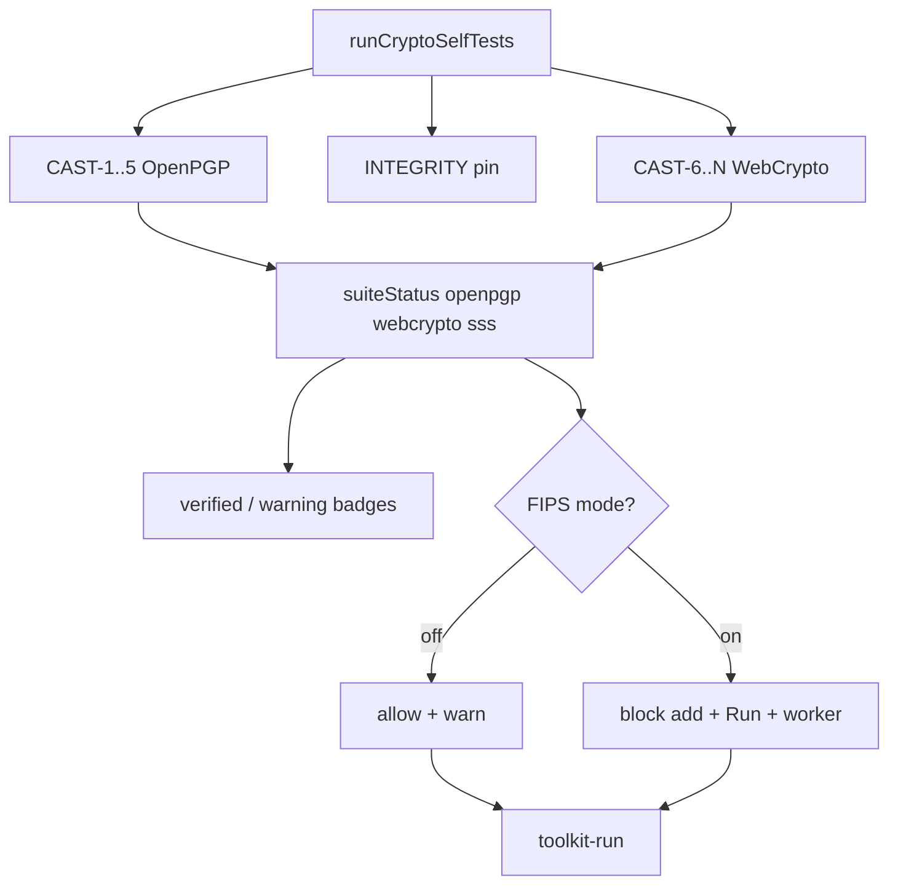

# Plan: CAST coverage + remaining test gaps

> **Status (2026-07-24):** Implemented — suite badges + FIPS mode (Phase 0), CAST-6…11 WebCrypto + CAST-12 SSS/BLIP39 (Phase A + SSS), expanded unit/type tests (Phase B), toolkit-run worker smoke (B3), CRYPTOGRAPHY.md updates (Phase C). Quorum CAST suite and product non-goals remain deferred.

Extend FIPS-inspired POST/CAST to cover shipped WebCrypto toolkit paths (today only OpenPGP CAST-1…5 run), make the **UI refuse to imply verification it does not have**, then fill unit/type/worker test gaps and document remaining deferred product items.

## Problem

[`web/src/lib/crypto-self-test.js`](../web/src/lib/crypto-self-test.js) still runs **OpenPGP-only** CAST-1…5 (+ integrity pin). Encrypt / Decrypt / Toolkit UIs show a single “crypto verified” latch, then the toolkit enables **Run** for recipes that call **SubtleCrypto** ops (`digest`, `sign`, `aesgcm`, `hkdf`, `pbkdf2`, `ecdh`, `wrap`) that CAST never exercised. SSS/BLIP39 is similarly ungated.

[`web/src/test/toolkit-webcrypto.test.js`](../web/src/test/toolkit-webcrypto.test.js) is a narrow smoke matrix (mostly Ed25519 / AES-256 / P-256). Quorum session crypto is also WebCrypto and remains outside the CAST gate (document explicitly; optional later).

---

## Phase 0 — UI honesty + FIPS mode toggle

Stop the false green light **before or while** WebCrypto CASTs land. Default UX stays usable with **warning badges**; a **FIPS mode** toggle hard-enforces verified-only crypto.

### Model: verification suites (not one boolean)

Replace the toolkit’s single “all crypto OK” banner with suite status derived from POST results:

| Suite | Covers toolkit `toolbox` | Today | After Phase A |
|-------|--------------------------|-------|---------------|
| `openpgp` | `openpgp` | CAST-1…5 → verified | same |
| `webcrypto` | `webcrypto` | **unverified** | CAST-6…11 → verified |
| `sss` | `sss` | **unverified** (no CAST yet) | optional CAST later |
| _(none)_ | `encoding`, `io`, `flow` | always usable; **no** VERIFIED claim | same |

Export from [`crypto-self-test.js`](../web/src/lib/crypto-self-test.js):

- `getSuiteStatus()` → `{ openpgp, webcrypto, sss }` each `verified | unverified | error`
- `assertSuiteReady(suite)` for hard gates
- Module ERROR still blocks everything crypto-related (FIPS on or off)

### Warning badges (always on)

Regardless of FIPS mode:

1. **Ops drawer / suggest-next / pipeline cards**
   - Verified crypto toolbox: small green **verified** chip.
   - Unverified crypto toolbox/op: amber **warning** badge (e.g. `⚠ unverified` / `no CAST`).
   - Tooltip: which suite is missing and that FIPS mode will block it.
   - Non-crypto toolboxes (`encoding` / `io` / `flow`): no verified claim, no warning.

2. **Status banner**
   - Suite-aware, never “all crypto verified” when only OpenPGP passed.
   - Example: `OpenPGP ✓ · WebCrypto ⚠ · SSS ⚠ · root …`
   - After Phase A: `OpenPGP ✓ · WebCrypto ✓ · SSS ⚠ · …`

3. **Encrypt / Decrypt**
   - Keep OpenPGP CAST gate. Banner says **OpenPGP** verified (not generic “crypto module”) until both OpenPGP + WebCrypto suites pass if we ever share copy.

### FIPS mode toggle

Explicit control on the toolkit header (encrypt/decrypt/settings later if useful):

| FIPS mode | Unverified suite ops | Run / worker |
|-----------|----------------------|--------------|
| **Off** (default for exploration) | Usable; amber warning badges only | Allowed; optional status note “recipe uses unverified suites” |
| **On** | Cannot add from drawer / suggest; existing steps marked blocked | **Run disabled**; worker refuses with clear error |

When FIPS **on**:

- Block append/drag of ops whose toolbox maps to an unverified suite.
- If recipe already contains them (paste/load/preset): keep visible, blocked cards, disable Run, error like `FIPS mode: recipe uses unverified WebCrypto ops (aesgcm, sign)`.
- Engine/worker double-check: refuse unverified suites when FIPS is on (pass flag in `toolkit-run` or shared preference) so UI bypass is not enough.
- Persist preference (`localStorage` e.g. `basilisk.fipsMode`).
- **Disclaimer:** this is Basilisk’s FIPS-*inspired* posture (POST/CAST + verified-only), **not** a NIST FIPS 140 certificate. Tooltip/subtitle: `Verified suites only (POST/CAST). Not a FIPS 140 certificate.`

If “FIPS mode” is too strong for product/legal copy, rename to `Strict CAST` / `Verified only` — keep the same behavior.

### SSS under FIPS mode

Same as WebCrypto: warning badge always; blocked when FIPS on until an SSS CAST exists. No carve-out unless we later document and remove it from the gate on purpose.

---

## Phase A — WebCrypto CASTs in POST (primary)

Extend `_runAllTests()` in [`web/src/lib/crypto-self-test.js`](../web/src/lib/crypto-self-test.js). Prefer calling helpers from [`web/src/lib/toolkit/webcrypto-ops.js`](../web/src/lib/toolkit/webcrypto-ops.js) so CAST and toolkit share one implementation (avoid drift). Keep OpenPGP CAST-1…5 unchanged.

| ID | Name | Concrete check |
|----|------|----------------|
| **CAST-6** | Digest KAT | `subtle.digest("SHA-256", "basilisk")` equals known hex (same vector as unit test) |
| **CAST-7** | AES-GCM roundtrip | Random 32 B key; encrypt/decrypt canary via `aesGcmEncrypt`/`aesGcmDecrypt`; wipe buffers |
| **CAST-8** | Sign / verify | Ed25519 (and optionally ECDSA P-256) via `subtleSign`/`subtleVerify` |
| **CAST-9** | ECDH agree | Two P-256 ECDH pairs; shared bits equal (quorum-shaped) |
| **CAST-10** | HKDF KAT | Fixed IKM/salt/info → fixed-length OKM (document vector in comment) |
| **CAST-11** | AES-KW wrap/unwrap | `aesKwWrap`/`aesKwUnwrap` roundtrip on AES-GCM CEK |

Also:

- Add fields to `SelfTestResults` + `SELF_TEST_LABELS`
- Fix stale header comment (“four CASTs” → full list including WebCrypto)
- Zeroize ephemeral keys/buffers per [`memory-safety.js`](../web/src/lib/memory-safety.js)
- Soft-fail optional algos only if we choose X25519 later and UA lacks it — **v1: P-256/Ed25519/AES-256 only** (hard fail)

Update [`web/src/test/crypto-self-test.test.js`](../web/src/test/crypto-self-test.test.js) to assert new result flags and that failure still latches ERROR.

**Out of POST for now:** full recipe `runRecipe` inside CAST (too heavy); PBKDF2 (slow); every curve/size (covered in unit tests).

---

## Phase B — Expand unit / type tests

### B1 — `toolkit-webcrypto.test.js`

Add cases for shipped but untested paths:

- `digest` SHA-384 / SHA-512 lengths
- `sign`/`verify`: ECDSA P-256, RSA-PSS (2048), HMAC-SHA-256
- `aesgcm`: AES-128; `aad=` authenticate-fail on mismatch
- `ecdh`: X25519 when `crypto.subtle.generateKey("X25519", …)` works (skip with message if unavailable)
- `hkdf`/`pbkdf2`: `hash=sha-512`
- Compile-time: `aesgcm`/`sign` report `inputNeeds` includes `key`

### B2 — `toolkit-types.test.js`

Refined-type walks for `digest`, `sign`, `aesgcm`, `hkdf`, `ecdh`, `wrap`/`unwrap` (accept bytes/text; ecdh/wrap from `none`).

### B3 — Optional worker smoke

One test or small harness: post `toolkit-run` with `random 16 | digest | hex` through [`crypto-worker.js`](../web/src/lib/crypto-worker.js) (or extract a testable `runToolkitInWorker` helper). Confirms worker SubtleCrypto path, not only main-thread `runRecipe`.

---

## Phase C — Docs / product hygiene (no new crypto features)

Update [`docs/CRYPTOGRAPHY.md`](CRYPTOGRAPHY.md):

- CAST section: OpenPGP CAST-1…5 **and** WebCrypto CAST-6…11; toolkit/quorum relationship
- FIPS mode: warning badges always; hard gate when on; disclaimer (not a FIPS 140 cert)
- Note: `genkey` can create RSA-OAEP keys but **no** asymmetric WebCrypto encrypt op yet (only `aesgcm`) — gap or future `rsaoaep`
- Keep deferred: AES-CBC/CTR, PKCS1-v1_5, soft verify, OpenPGP padding tag 21
- Clarify Quorum ECDH/HKDF/AES-GCM is **not** gated by CAST today (same as today; call out residual risk)

UI copy: suite-aware banners; “crypto module” only when OpenPGP + WebCrypto suites both pass.

---

## Phase D — Explicit non-goals (this plan)

- Soft `verify` boolean mode
- AES-CBC/CTR / RSAES-PKCS1-v1_5
- OpenPGP padding packets
- Quorum-specific CAST suite (separate follow-up if desired)
- Renaming OpenPGP `encrypt` / toolbox redesign
- Claiming NIST FIPS 140 validation via the toggle name
- Leaving unverified ops fully enabled with only a green banner and no FIPS gate (defeats Phase 0)

---

## Suggested order of work

1. **0** — Suite status API + warning badges + FIPS mode toggle (UI + worker enforce)
2. **A** — CAST-6…11 → flips `webcrypto` suite to verified; FIPS mode then allows those ops
3. **B1/B2** — broaden unit/type coverage
4. **C** — docs
5. **B3** — toolkit-run worker smoke (`executeToolkitRun`) ✓
6. **SSS CAST-12** — flips `sss` suite ✓

## Remaining deferred (non-goals / later)

- Quorum-specific CAST suite
- Soft `verify`, AES-CBC/CTR, OpenPGP padding, RSA-OAEP encrypt op

## Success criteria

- Default (FIPS off): WebCrypto/SSS usable but show amber **unverified** badges; banner is suite-specific
- FIPS on + only OpenPGP CASTs: WebCrypto/SSS cannot be added or run; worker refuses
- After CAST-6…11 + FIPS on: WebCrypto ops run; green verified chips; POST fails closed if AES-GCM or Ed25519 sign/verify is broken
- Toggle disclaimer visible; no implication of NIST certification
- `npx vitest run src/test/crypto-self-test.test.js src/test/toolkit-webcrypto.test.js src/test/toolkit-types.test.js` green
- CRYPTOGRAPHY.md CAST + FIPS-mode inventory matches code

## Implementation todos

1. Suite status + amber/verified badges + FIPS mode toggle (persist + worker enforce) + honest banners
2. Add CAST-6..11 WebCrypto KATs to `crypto-self-test.js`; update `SelfTestResults`/labels; latch + `crypto-self-test.test.js`
3. Expand `toolkit-webcrypto.test.js`: ECDSA/RSA-PSS/HMAC, digest 384/512, AES-128+AAD, X25519 skip, hkdf/pbkdf2 hashes
4. Add `toolkit-types.test.js` cases for new WebCrypto ops
5. Optional: toolkit-run worker smoke for digest recipe
6. Update CRYPTOGRAPHY.md CAST + FIPS-mode + RSA-OAEP/quorum notes; fix stale CAST count comment
