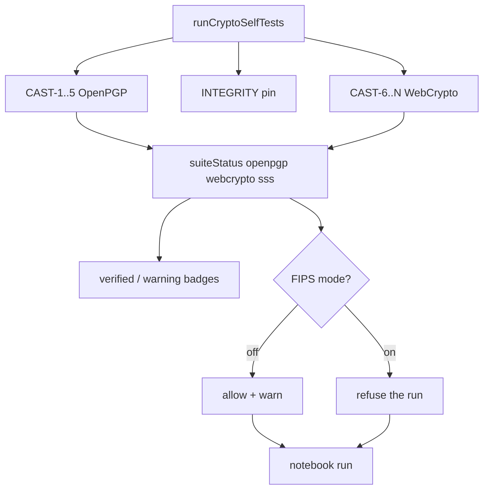

# Plan: CAST coverage + remaining test gaps

> **Status (2026-07-26):** Implemented — suite badges + FIPS mode (Phase 0), CAST-6…11 + CAST-13/14 WebCrypto + CAST-12 SSS/BLIP39, expanded unit/type tests, CRYPTOGRAPHY.md updates. Quorum CAST suite and OpenPGP padding remain deferred.
>
> **Status amendment (2026-08-23):** "Phase 0" above means the run-time half of
> it. FIPS mode refuses a **run**; it has never blocked an **add**, and now will
> not — see the authoring note below, which is where that decision and its
> reasoning live. The gate also did not reach the notebook until later than this
> line suggests: `useNotebook.buildBindings` sets `fipsMode`/`suiteStatus` and
> `startRun` asks about the whole scoped run, and before that wiring the switch
> drew a banner and stopped nothing.

> **Worker note (later than the plan below).** This plan assumed the toolkit
> could run inside the crypto worker, and half its enforcement story is written
> in those terms: a `toolkit-run` message, a worker that refuses, a second
> double-check behind the UI. That arm existed and was complete, and **nothing
> in the app ever posted to it** — `lib/generate-key.js` holds the only
> `new Worker(…crypto-worker.js…)` and the only message it sends is
> `type:"generate"`. The arm, `lib/toolkit/toolkit-run.js` and its
> `executeToolkitRun` entry point have all been deleted; see the header of
> [`crypto-worker.js`](../web/src/lib/crypto-worker.js) for the argument.
>
> So wherever the plan below says *worker* as a second enforcement point, there
> is one enforcement point and it is the notebook: `useNotebook.buildBindings`
> sets `fipsMode`/`suiteStatus` and `startRun` asks the gate about the whole run
> before the first cell executes. That is a simplification rather than a gap —
> the removed check guarded a message nobody sent — but it does mean the
> "UI bypass is not enough" argument in Phase 0 now rests on the gate sitting
> inside `runRecipe` rather than on a separate process. Routing the notebook
> through a worker is still a defensible design; it needs its own argument
> rather than arriving as this plan's leftover.

> **Vocabulary note (later than the plan below).** Where this document says
> *Quorum* it means the multi-party P2P session, since renamed the **shared
> notebook** (`web/src/lib/notebook/`). `web/src/lib/quorum/` now holds only the
> *m*-of-*n* threshold code. The deferred item is a CAST suite for the shared
> notebook's ECDH/HKDF/AES-GCM, and it is still deferred.

> **Authoring note (later than the plan below).** This plan promised FIPS mode
> two enforcement points — refuse the **run**, and refuse the **add** — and only
> the first was built. That is now the decision rather than the backlog:
> **authoring is deliberately ungated.** The table and the bullets below have
> been corrected to say so; this note is the argument, so that the missing half
> reads as a choice and not as an oversight waiting for someone to propose it
> again.
>
> Refusing at run time is the better place for the refusal. A person can
> compose, inspect and reason about a recipe without being stopped mid-thought,
> and the objection arrives where it can actually matter: `startRun` asks about
> the whole scoped run before the first cell executes, names the unverified
> suite and the steps in it, and says what to do about it. The sentence comes
> from `fipsRefusalText` in [`engine.js`](../web/src/lib/toolkit/engine.js), and
> the Params tab draws that same sentence as a preview, so the warning and the
> refusal cannot drift apart.
>
> An add-time block would also be weaker than it looks. The drawer is one door
> of several: a recipe arrives by share link, by file, by paste, from a preset,
> or from a peer in a shared notebook, and none of those routes passes the
> drawer. Gating the one door would claim a completeness the mechanism could not
> have — which is the same defect as a green badge for a suite nobody tested,
> only pointed the other way.
>
> What did ship at authoring time is *information*, never refusal: `CastDot`
> beside each drawer toolbox reports that toolbox's live suite state, and a
> static `CAST <suite>` / `no CAST suite` chip says which suite would qualify it
> at all. Two channels, one fact each — see the badges section below.

Extend FIPS-inspired POST/CAST to cover shipped WebCrypto toolkit paths (today only OpenPGP CAST-1…5 run), make the **UI refuse to imply verification it does not have**, then fill unit/type test gaps and document remaining deferred product items.

## Problem

*The state at writing (2026-07), kept as the record of what this plan was for.
Both halves have since been addressed: POST now runs CAST-1…14 and the smoke
matrix was widened per B1/B2. The one sentence still true today is the last one
— the shared notebook's session crypto is WebCrypto and remains outside the
gate.*

[`web/src/lib/crypto-self-test.js`](../web/src/lib/crypto-self-test.js) still runs **OpenPGP-only** CAST-1…5 (+ integrity pin). Encrypt / Decrypt / Toolkit UIs show a single “crypto verified” latch, then the toolkit enables **Run** for recipes that call **SubtleCrypto** ops (`digest`, `sign`, `aes-gcm`, `hkdf`, `pbkdf2`, `ecdh`, `wrap`) that CAST never exercised. SSS/BLIP39 is similarly ungated.

[`web/src/test/toolkit-webcrypto.test.js`](../web/src/test/toolkit-webcrypto.test.js) is a narrow smoke matrix (mostly Ed25519 / AES-256 / P-256). Quorum session crypto is also WebCrypto and remains outside the CAST gate (document explicitly; optional later).

*Diagram corrected: it had both branches feed a `toolkit-run` worker node. See
the worker note at the top — there is no worker leg, and the toggle's two
outcomes are read by the notebook's own run path. Note also that the toggle's
only edges are into `Run`: there is no edge into authoring, because the plan's
`block add` half was not built and will not be — see the authoring note above.*

---

## Phase 0 — UI honesty + FIPS mode toggle

Stop the false green light **before or while** WebCrypto CASTs land. Default UX stays usable with **warning badges**; a **FIPS mode** toggle hard-enforces verified-only crypto.

### Model: verification suites (not one boolean)

Replace the toolkit’s single “all crypto OK” banner with suite status derived from POST results:

| Suite | Covers toolkit `toolbox` | Today | After Phase A |
|-------|--------------------------|-------|---------------|
| `openpgp` | `openpgp` | CAST-1…5 → verified | same |
| `webcrypto` | `webcrypto`, `ssh` | **unverified** | CAST-6…11 (+13/14) → verified |
| `sss` | `sss` | **unverified** (no CAST yet) | CAST-12 shipped → verified |
| _(none)_ | everything else | always usable; **no** VERIFIED claim | same |

*Mapping corrected against [`suite-gate.js`](../web/src/lib/toolkit/suite-gate.js)'s
`toolboxToSuite`, which is the only place this question is answered. `ssh` maps
to `webcrypto` because SSH's maths is SubtleCrypto/@noble — the thing the
self-test actually exercises — while the encodings get interop fixtures instead.
The `(none)` row is much wider than the three toolboxes first written here:
`encoding`, `io`, `flow`, and also `quorum`, `webrtc`, `webauthn`, `jose`,
`age`, `otp`, `agent`, `hkp`. Two different reasons live in that row and this
plan does not conflate them. `webauthn` is a deliberate non-claim — a passkey's
keypair lives inside an authenticator this page cannot address, so there is no
vector to run and no result to gate on. `jose` and `age` are simply unclaimed:
they are real crypto, `jose-ops.js` reaches SubtleCrypto through
`webcrypto-ops.js` helpers, and FIPS mode does not refuse them today because
their toolboxes name no suite. That is a gap in coverage, not a decision, and it
is recorded here rather than fixed by widening the map — a toolbox pointed at
`webcrypto` would inherit a "verified" that CAST-6…14 never earned for it.*

Export from [`crypto-self-test.js`](../web/src/lib/crypto-self-test.js):

- `getSuiteStatus()` → `{ openpgp, webcrypto, sss }` each `verified | unverified | error`
- `assertSuiteReady(suite)` for hard gates — **exists, and no hard gate calls it.** Grepping `web/src` finds the export, `crypto-self-test.test.js` importing it, and nothing else; the hard gate that shipped is `assertRecipeAllowedUnderFips`, which asks about a whole recipe rather than one named suite. So this line describes an entry point kept alive by its own test. It is left in place rather than quietly deleted, because per-suite readiness is a reasonable thing for a future caller to want — but until one exists, nobody should cite this function as a protection in force
- Module ERROR still blocks everything crypto-related (FIPS on or off) — `getSuiteStatus` reports `error` for all three suites while the module is latched ERROR, so every gated suite is unverified and every recipe touching one is refused

### Warning badges (always on)

Regardless of FIPS mode:

1. **Ops drawer** — shipped there and, on purpose, only there.
   - Verified crypto toolbox: green `CastDot`; unverified: amber; self-test
     ERROR: red, labelled `self-test FAILED — do not rely on this op`.
   - Beside it, a static `CAST openpgp` / `CAST webcrypto` / `CAST sss` /
     `no CAST suite` chip. The dot is live state, the chip is a fact about the
     registry; the chip exists because a rendered nothing and "no suite covers
     this" look identical otherwise.
   - Tooltip names the toolbox and its self-test state. It does **not** say
     "FIPS mode will block it", as first planned — the dot reports the
     self-test, and what a switch elsewhere would do about it is the switch's
     sentence to write, in the Params tab, where it can name the actual steps.
   - **Not** on suggest-next chips or pipeline cards.
     [`artifact-roles.test.js`](../web/src/test/artifact-roles.test.js) and
     [`cast-indicator.test.js`](../web/src/test/cast-indicator.test.js) pin that
     `OpsTile` carries no `CastDot` and that the shelf renders exactly one:
     `data-cast` means *suite self-test* and nothing else, and a card's own
     verdicts (a signature, a JWT) must not borrow the place a reader has
     learned to read a suite's state.
   - Non-crypto toolboxes: no verified claim, no warning — the dot renders
     nothing where `toolboxToSuite` returns `null`.

2. **Status banner**
   - Suite-aware, never “all crypto verified” when only OpenPGP passed.
   - Example: `OpenPGP ✓ · WebCrypto ⚠ · SSS ⚠ · root …`
   - Shipped as `formatSuiteStatusMessage`; with CAST-6…14 and CAST-12 in POST a
     clean boot now reads `OpenPGP ✓ · WebCrypto ✓ · SSS ✓ · …` plus elapsed
     time, module root and pin.

3. **Encrypt / Decrypt**
   - Keep OpenPGP CAST gate. Banner says **OpenPGP** verified (not generic “crypto module”) until both OpenPGP + WebCrypto suites pass if we ever share copy.

### FIPS mode toggle

Explicit control on the toolkit header (encrypt/decrypt/settings later if useful):

| FIPS mode | Unverified suite ops | Run |
|-----------|----------------------|--------------|
| **Off** (default for exploration) | Usable; amber warning badges only | Allowed; optional status note “recipe uses unverified suites” |
| **On** | Still addable, still editable — authoring is ungated by design (see the authoring note) | **Run refused** with a clear error, before the first step executes |

When FIPS **on**:

- ~~Block append/drag of ops whose toolbox maps to an unverified suite.~~
  **Withdrawn, not deferred** — authoring stays open on purpose; the argument is
  in the authoring note at the top. The drawer marks the suite, it does not
  refuse the add.
- If the recipe contains them (typed, pasted, loaded, preset, or arrived from a
  peer): the cells stay ordinary editable cells, Run stays pressable, and the
  Params tab draws the refusal the run would give, word for word. Pressing Run
  sets the status to `Blocked` and executes nothing. *Two details of the
  original bullet did not ship and are not planned: cards are not marked
  blocked, and Run is not disabled. A disabled Run cannot say why in the place
  the person is looking, and a refusal a person can read beats a control they
  can only find greyed out.*
- Engine double-check: refuse unverified suites when FIPS is on (the flag rides
  in the bindings the notebook hands `runRecipe`) so UI bypass is not enough.
  *Planned as an engine/worker pair; only the engine half exists — see the
  worker note. In its place the notebook asks the same question once for the
  whole scoped run in `startRun`, because `runCell` hands the engine one cell at
  a time and a per-cell gate alone would run cells 1 and 2 before refusing cell
  3. Both checks are live: `runCeremonyStage` calls `runCell` without passing
  through `startRun`, so the engine backstop is what makes the refusal a
  property of running rather than of pressing one particular button.*
- Persist preference (`localStorage` e.g. `basilisk.fipsMode`).
- **Disclaimer:** this is Basilisk’s FIPS-*inspired* posture (POST/CAST + verified-only), **not** a NIST FIPS 140 certificate. Tooltip/subtitle: `Verified suites only (POST/CAST). Not a FIPS 140 certificate.`

If “FIPS mode” is too strong for product/legal copy, rename to `Strict CAST` / `Verified only` — keep the same behavior.

### SSS under FIPS mode

Same as WebCrypto: warning badge always; refused when FIPS on until an SSS CAST exists. No carve-out unless we later document and remove it from the gate on purpose.

*Settled: CAST-12 shipped (GF(256) split/combine + BLIP39 roundtrip), so `sss`
reports **verified** on a clean boot and FIPS mode allows SSS ops. The rule
above is what still holds if that CAST ever fails — no carve-out, the suite goes
amber and the run is refused like any other.*

---

## Phase A — WebCrypto CASTs in POST (primary)

Extend `_runAllTests()` in [`web/src/lib/crypto-self-test.js`](../web/src/lib/crypto-self-test.js). Prefer calling helpers from [`web/src/lib/toolkit/webcrypto-ops.js`](../web/src/lib/toolkit/webcrypto-ops.js) so CAST and toolkit share one implementation (avoid drift). Keep OpenPGP CAST-1…5 unchanged.

| ID | Name | Concrete check |
|----|------|----------------|
| **CAST-6** | Digest KAT | `subtle.digest("SHA-256", "basilisk")` equals known to hex (same vector as unit test) |
| **CAST-7** | AES-GCM roundtrip | Random 32 B key; encrypt/decrypt canary via `aesGcmEncrypt`/`aesGcmDecrypt`; wipe buffers |
| **CAST-8** | Sign / verify | Ed25519 (and optionally ECDSA P-256) via `subtleSign`/`subtleVerify` |
| **CAST-9** | ECDH agree | Two P-256 ECDH pairs; shared bits equal (quorum-shaped) |
| **CAST-10** | HKDF KAT | Fixed IKM/salt/info → fixed-length OKM (document vector in comment) |
| **CAST-11** | AES-KW wrap/unwrap | `aesKwWrap`/`aesKwUnwrap` roundtrip on AES-GCM CEK |
| **CAST-13** | AES-CBC roundtrip | `aesCbcEncrypt`/`aesCbcDecrypt` canary (IV\|\|CT) |
| **CAST-14** | AES-CTR roundtrip | `aesCtrEncrypt`/`aesCtrDecrypt` canary (IV\|\|CT) |

Also:

- Add fields to `SelfTestResults` + `SELF_TEST_LABELS` — done; `crypto-self-test.test.js` asserts the keys and that each label names its CAST id
- ~~Fix stale header comment (“four CASTs” → full list including WebCrypto)~~ — done; the header now lists CAST-1…14, WebCrypto and SSS included
- Zeroize ephemeral keys/buffers per [`memory-safety.js`](../web/src/lib/memory-safety.js)
- Soft-fail optional algos only if we choose X25519 later and UA lacks it — **v1: P-256/Ed25519/AES-256 only** (hard fail)

Update [`web/src/test/crypto-self-test.test.js`](../web/src/test/crypto-self-test.test.js) to assert new result flags and that failure still latches ERROR.

**Out of POST for now:** full recipe `runRecipe` inside CAST (too heavy); PBKDF2 (slow); every curve/size (covered in unit tests).

---

## Phase B — Expand unit / type tests

### B1 — `toolkit-webcrypto.test.js` — done

Every case below is in the file today (X25519 returns early with a message when
the environment lacks it, as planned). Add cases for shipped but untested paths:

- `digest` SHA-384 / SHA-512 lengths
- `sign`/`verify`: ECDSA P-256, RSA-PSS (2048), HMAC-SHA-256
- `aes-gcm`: AES-128; `aad=` authenticate-fail on mismatch
- `ecdh`: X25519 when `crypto.subtle.generateKey("X25519", …)` works (skip with message if unavailable)
- `hkdf`/`pbkdf2`: `hash=sha-512`
- Compile-time: `aes-gcm`/`sign` report `inputNeeds` includes `key`

### B2 — `toolkit-types.test.js` — done

Refined-type walks for `digest`, `sign`, `aes-gcm`, `hkdf`, `ecdh`, `wrap`/`unwrap` (accept bytes/text; ecdh/wrap from `none`).

### B3 — Optional worker smoke — **withdrawn, not deferred**

~~One test or small harness: post `toolkit-run` with `random 16 | digest | to hex` through [`crypto-worker.js`](../web/src/lib/crypto-worker.js) (or extract a testable `runToolkitInWorker` helper). Confirms worker SubtleCrypto path, not only main-thread `runRecipe`.~~

This was built and has been removed with the arm it exercised. It is struck rather than moved to the deferred list, because the two are different promises: a deferred item says *do this later*, and doing this later now means **re-adding the `toolkit-run` arm in order to have something to smoke-test**. That is the defect that was just removed — a complete, tested mechanism with no caller, advertising an isolation boundary the app does not have (the toolkit holds unlocked private keys on the main thread throughout).

The item's stated value was "confirms worker SubtleCrypto path, not only main-thread `runRecipe`". There is no worker SubtleCrypto path to confirm; `crypto-worker.js` does OpenPGP keygen and nothing else. A test here would have measured a path that exists only because the test wanted one.

What the item was really reaching for — *the engine's WebCrypto ops are exercised somewhere* — is covered by B1/B2 against `runRecipe` directly, which is the path the app uses. If the notebook is ever routed through a worker, this smoke test comes back as part of that design's own argument, not as a leftover checkbox from this plan.

---

## Phase C — Docs / product hygiene (no new crypto features)

Update [`docs/CRYPTOGRAPHY.md`](CRYPTOGRAPHY.md):

- CAST section: OpenPGP CAST-1…5 **and** WebCrypto CAST-6…11 + 13/14 **and** SSS CAST-12; toolkit/shared-notebook relationship — done, as a three-row suite table
- FIPS mode: warning badges always; hard gate when on; disclaimer (not a FIPS 140 cert) — done, and `CRYPTOGRAPHY.md` is the file that says plainly there is no add-time gate. That sentence and the authoring note at the top of this file are the same claim; if one is ever changed, change both
- Note: WebCrypto toolkit now includes `rsaoaep`, `aescbc`/`aesctr`, soft verify, discouraged PKCS1 paths — CAST covers CBC/CTR as CAST-13/14; soft verify / sha-1 / rsapkcs1 / RSASSA-PKCS1 remain behavioral (non-CAST)
- Keep deferred: OpenPGP padding tag 21; ~~AES-GCM/CBC as wrap algorithms~~ (shipped — see the deferred list); shared-notebook CAST suite
- Clarify Quorum ECDH/HKDF/AES-GCM is **not** gated by CAST today (same as today; call out residual risk)

UI copy: suite-aware banners; “crypto module” only when OpenPGP + WebCrypto suites both pass.

---

## Phase D — Explicit non-goals (this plan)

- OpenPGP padding packets
- ~~AES-GCM/CBC as wrap algorithms (toolkit wrap stays AES-KW + RSA-OAEP)~~ — **overtaken:** `wrap`/`unwrap` now accept `mode=aes-gcm|aes-cbc|aes-ctr` alongside `aes-kw` and `rsa-oaep`. Struck rather than deleted, because a reader who finds these modes shipped should be able to see that this plan ruled them out and that a later change reversed it, not wonder whether they slipped past a non-goal
- Quorum-specific CAST suite (separate follow-up if desired)
- ~~Renaming OpenPGP `encrypt` / toolbox redesign~~ — shipped as `gpg.*` / `sss.*` / `webauthn.*` + hyphen ciphers
- Claiming NIST FIPS 140 validation via the toggle name
- Leaving unverified ops fully enabled with only a green banner and no FIPS gate (defeats Phase 0)
- CAST entries for discouraged/soft paths (`digest sha-1`, `rsapkcs1`, soft verify, `padding=pkcs1`) — unit-tested only

---

## Suggested order of work

1. **0** — Suite status API + warning badges + FIPS mode toggle (UI + engine enforce)
2. **A** — CAST-6…11 → flips `webcrypto` suite to verified; FIPS mode then allows those ops
3. **B1/B2** — broaden unit/type coverage
4. **C** — docs
5. **B3** — ~~toolkit-run worker smoke (`executeToolkitRun`)~~ withdrawn; built, then removed with the arm (see B3)
6. **SSS CAST-12** — flips `sss` suite ✓

## Remaining deferred (non-goals / later)

- CAST suite for the shared notebook's session crypto (the item this plan calls *Quorum* — see the vocabulary note). Still ungated: `quorum` is one of the toolboxes `toolboxToSuite` maps to `null`, so FIPS mode has nothing to refuse there
- OpenPGP padding packets — investigated 2026-07 and skipped rather than merely postponed: OpenPGP.js 6.x can parse and write `PaddingPacket`, but its high-level `encrypt()` exposes no config flag to emit one, so this needs a fork of message construction. The finding is kept beside the code, in [`pgp/encrypt.js`](../web/src/lib/pgp/encrypt.js)
- ~~AES wrap formats beyond KW / RSA-OAEP~~ — **shipped, no longer deferred.** `wrap`/`unwrap` take `mode=aes-kw|aes-gcm|aes-cbc|aes-ctr|rsa-oaep` (IV‖wrapped for the AES modes). The Phase D non-goal that promised the opposite is struck where it stands. No CAST covers a wrap *mode* as such; CAST-11 exercises AES-KW and CAST-7/13/14 the AES primitives underneath the others
- Suites for the crypto toolboxes that name none today (`jose`, `age`) — see the note under the suite table

## Success criteria

- Default (FIPS off): WebCrypto/SSS usable but show amber **unverified** badges; banner is suite-specific — *written for the pre-Phase-A state; with CAST-6…14 and CAST-12 shipped a clean boot shows all three green, and the amber case is now what a **failed or skipped** CAST looks like*
- FIPS on + only OpenPGP CASTs: WebCrypto/SSS cannot be run; the gate inside `runRecipe` refuses, and `startRun` refuses the whole scoped run before any cell executes
- FIPS on, at any time: nothing is un-addable and no cell is un-editable — the refusal is a property of running (authoring note)
- After CAST-6…11 + FIPS on: WebCrypto ops run; green verified chips; POST fails closed if AES-GCM or Ed25519 sign/verify is broken
- Toggle disclaimer visible; no implication of NIST certification
- `npx vitest run src/test/crypto-self-test.test.js src/test/toolkit-webcrypto.test.js src/test/toolkit-types.test.js` green
- CRYPTOGRAPHY.md CAST + FIPS-mode inventory matches code

## Implementation todos

1. Suite status + amber/verified badges + FIPS mode toggle (persist + engine enforce + notebook `startRun` pre-check) + honest banners. No add-time enforcement — see the authoring note
2. Add CAST-6..11 WebCrypto KATs to `crypto-self-test.js`; update `SelfTestResults`/labels; latch + `crypto-self-test.test.js`
3. Expand `toolkit-webcrypto.test.js`: ECDSA/RSA-PSS/HMAC, digest 384/512, AES-128+AAD, X25519 skip, hkdf/pbkdf2 hashes
4. Add `toolkit-types.test.js` cases for new WebCrypto ops
5. ~~Optional: toolkit-run worker smoke for digest recipe~~ — withdrawn, see B3
6. Update CRYPTOGRAPHY.md CAST + FIPS-mode + RSA-OAEP/quorum notes; fix stale CAST count comment
